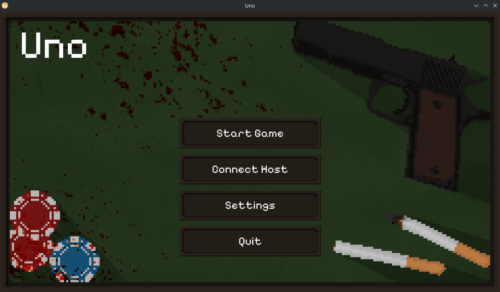

# Uno

**Status: Work in Progress**

A modern, networked clone of the popular Uno card game, built with C++ and modern game development libraries. It supports natively **Windows** and **Linux**. Core gameplay mechanics and networking features are actively being developed.



## Features

- **Cross-platform support:** Powered by [SDL3](https://github.com/libsdl-org/SDL) for broad hardware and OS compatibility.
- **Modern UI:** Responsive, web-like interfaces using [RmlUi](https://github.com/mikke89/RmlUi).
- **Networked Multiplayer:** Client-server architecture using Valve's [GameNetworkingSockets](https://github.com/ValveSoftware/GameNetworkingSockets).
- **Efficient Data Transfer:** Protocol Buffers for fast and reliable game state synchronization.

## Tech Stack

- **Windowing & Input:** SDL3
- **Grahipcs:** OpenGL & SDL_image
- **UI:** RmlUi
- **Networking:** GameNetworkingSockets, Protobuf

## Getting Started

### Requirements

- A C++23 compatible compiler (GCC 12+, Clang 15+, or MSVC 19.34+)
- [CMake](https://cmake.org/download/) (v3.5 or higher)
- [vcpkg](https://vcpkg.io/en/getting-started.html) for managing dependencies

### Building

1. **Clone the repository:**
   ```bash
   git clone https://github.com/l-nikita/uno.git
   cd uno
   ```

2. **Configure with vcpkg and CMake:**
   ```bash
   cmake -B build -S . -DCMAKE_TOOLCHAIN_FILE=[path-to-vcpkg]/scripts/buildsystems/vcpkg.cmake
   ```

3. **Build the project:**
   ```bash
   cmake --build build
   ```
